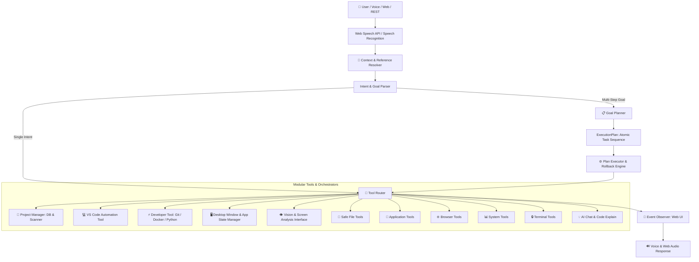

# 🤖 Intelligent AI Desktop Agent (Nova)

A **goal-oriented, intelligent AI Desktop Agent** that goes beyond simple single-command execution. Nova features a multi-step reasoning **Planner**, **Project Manager**, **VS Code & Developer Workflow Tools**, **Desktop State Tracker**, **Context Reference Resolver**, and **Vision Interfaces**, while preserving full voice and web STT compatibility.

---

## 🌟 Architecture & Capabilities



---

## ✨ Upgraded Features

| Module | Key Capabilities |
|--------|------------------|
| **Goal Planner (`planner/`)** | Decomposes high-level goals (*"Start working"*, *"Setup FastAPI project"*, *"Prepare for coding"*) into structured `ExecutionPlans` with rollback capability and step-by-step event broadcasting. |
| **Project Manager (`projects/`)** | Auto-discovers and tracks projects, detects frameworks (FastAPI, React, Django, Node, Flutter, Streamlit), tracks git origins and workspaces in `data/projects.db`. |
| **VS Code Tool (`tools/vscode_tool.py`)** | Automated project opening, recent workspace reopening, file-at-line navigation, task triggering, extension installation, and template project generation. |
| **Developer Tool (`tools/developer_tool.py`)** | Git workflows (`git status`, `git commit`, `git push`, `git pull`), Python virtualenv lifecycle, package management, script runner, and Docker container inspection/compose. |
| **Desktop Manager (`desktop/`)** | Desktop state tracking (`opened_apps`, `focused_app`, `recent_apps`), workspace restoration, window focus switching, minimize/maximize. |
| **Context Resolver (`brain/memory.py`)** | Anaphoric reference resolution (*"open it"*, *"close it"*, *"run it again"*, *"search it on Google"*, *"open my backend"*, *"open newest pdf"*). |
| **Vision Interface (`vision/`)** | Extensible placeholders for OCR text extraction, visual layout analysis, screenshot understanding, and UI object detection. |
| **Safety & Control** | Strict command allowlist, path sandboxing, deletion confirmation, shell safety, and execution logging in SQLite. |

---

## 📁 Directory Structure

```
ai-laptop-handler/
├── main.py                     # Central coordinator (defaults to Web mode)
├── config.py                   # Global configuration
├── requirements.txt            # Python dependencies
├── test_agent_pipeline.py      # Comprehensive verification test suite
├── planner/                    # 📋 Goal Decomposition & Execution Plan Engine
│   ├── task.py                 # Task & ExecutionPlan dataclasses
│   ├── planner.py              # Goal templates & LLM planning engine
│   └── executor.py             # Sequential executor, event notification & rollback engine
├── projects/                   # 📁 Project Manager & Framework Scanner
│   └── project_manager.py      # SQLite project DB, scanner, & query engine
├── desktop/                    # 🖥️ Desktop State & Window Manager
│   └── desktop_manager.py      # App focus tracking, session restore, close all
├── vision/                     # 👁️ Vision & Visual Interface
│   └── vision_interface.py     # OCR, visual layout, and object detection placeholders
├── brain/
│   ├── llm.py                  # LLM provider abstraction (Offline / Ollama / Gemini)
│   ├── intent_parser.py        # Intent & Goal detection with reference resolution
│   └── memory.py               # Short-term, persistent SQLite history & context resolver
├── router/
│   └── tool_router.py          # Unified tool handler registry & router
├── tools/                      # 🛠️ Specialized Tool Modules
│   ├── vscode_tool.py          # VS Code project & workspace orchestration
│   ├── developer_tool.py       # Git, Docker, Python virtualenvs
│   ├── extended_tools.py       # File clean/archive, newest PDF, search docs, tutorials
│   ├── file_tools.py           # Safe file & directory operations
│   ├── app_tools.py            # App launcher and process control
│   ├── browser_tools.py        # Web search & URL navigation
│   ├── system_tools.py         # Hardware stats, volume, brightness, screenshots
│   ├── terminal_tools.py       # Cross-platform safe terminal execution
│   └── ai_tools.py             # Code explanation & general Q&A
├── ui/
│   └── web/                    # 🌐 Web UI & Browser STT (Auto-listening interface)
└── data/
    ├── history.db              # Command history database
    └── projects.db             # Tracked projects database
```

---

## 🎮 How to Run

### 1. Web Mode (Default) 🌐

```bash
python3 main.py
```
Open `http://127.0.0.1:8000` in Google Chrome or Microsoft Edge. Speech recognition is active in the background automatically upon page load.

### 2. Multi-Step Goal Execution in Text Mode

```bash
python3 main.py --text
```

Try goals like:
- `Start working`
- `Setup FastAPI project`
- `Open VS Code and create a folder called Internship`
- `Clean Downloads folder`
- `Open my backend`
- `run it again`

### 3. Verification Test Suite

Run the full automated test suite:

```bash
python3 test_agent_pipeline.py
```

---

## 🗣️ High-Level Goal Examples

| Goal / Command | Actions Executed by Planner |
|----------------|-----------------------------|
| `"Start working"` | Finds recent project → Opens VS Code workspace → Checks `git status` → Checks RAM usage |
| `"Setup FastAPI project"` | Creates folder `~/Projects/fastapi_backend` → Creates venv → Opens VS Code → Creates `main.py` → Installs `fastapi uvicorn` |
| `"Open VS Code and create a folder called Internship"` | Creates folder `~/Projects/Internship` → Opens VS Code in folder |
| `"Clean Downloads folder"` | Sorts files in `~/Downloads` into `Images`, `Documents`, `Code`, `Archives` |
| `"Open my backend"` | Resolves tag/name "backend" in Project Database → Opens project in VS Code |
| `"open it"` | Resolves "it" to `last_project` or `last_app` and launches it |
| `"run it again"` | Re-executes `last_command` |

---

## 🔒 Safety Gating & Isolation

- **Dangerous Actions**: File deletion and app closing require explicit confirmation.
- **Allowed Shell Commands**: Terminal commands are strictly gated by cross-platform command translation (`dir`/`ls`, `git status`, `python --version`, etc.) using safe `subprocess` invocation (`shell=False`).
- **Path Isolation**: File actions are restricted to the user's home directory tree (`~`).

---

## 📝 License

MIT License — Built with ❤️ as an internship-ready AI project.
