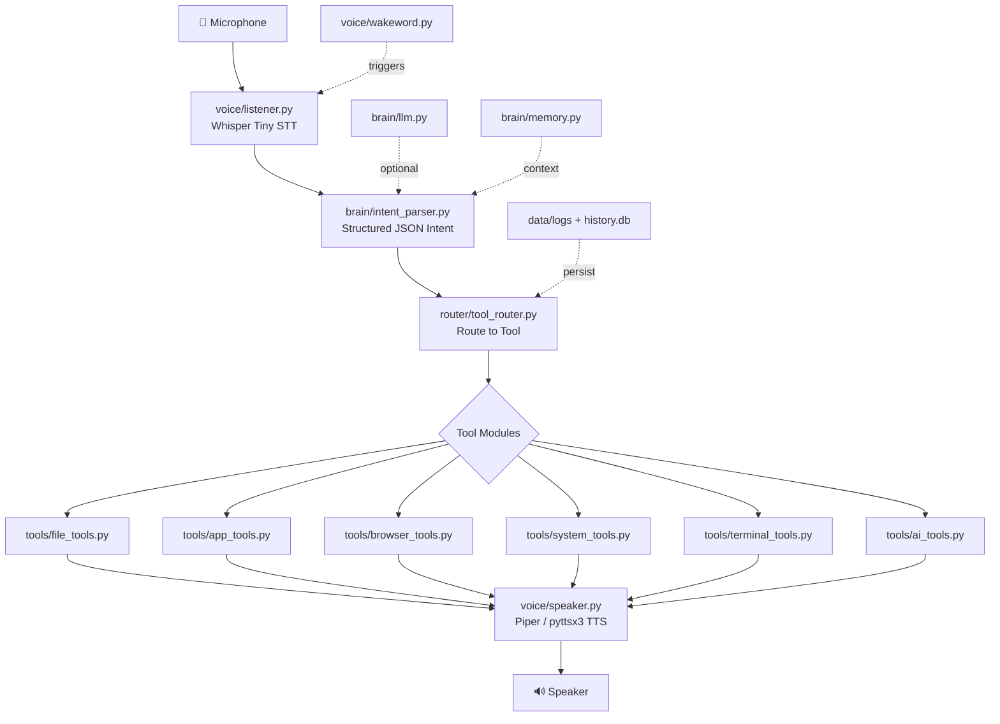

# AI Laptop Voice Handler — Implementation Plan

A modular, voice-controlled laptop assistant that listens via microphone, understands intent, routes to safe tool modules, and speaks responses back. Designed for a ~4 GB VRAM / CPU-only laptop.

## Architecture Overview



## Proposed Changes

### Phase 1 — Project Scaffolding

Create folder structure, config files, and entry point skeleton.

#### [NEW] Project root files

| File | Purpose |
|------|---------|
| `main.py` | Main event loop coordinator |
| `requirements.txt` | All pip dependencies |
| `.env.example` | Environment variable template |
| `README.md` | Full documentation |
| `config.py` | Centralized configuration constants |

#### [NEW] Package `__init__.py` files

Empty init files for: `voice/`, `brain/`, `router/`, `tools/`, `ui/`, `api/`

---

### Phase 2 — Voice Input (`voice/listener.py`)

**Model:** `faster-whisper` with `tiny` model (~75 MB, runs on CPU in <1s per utterance).

- Record audio from mic using `sounddevice` (cross-platform, no PyAudio compilation issues)
- Save to temp WAV buffer using `scipy.io.wavfile`
- Transcribe with `faster-whisper` (CTranslate2 backend, very fast on CPU)
- Return cleaned text string
- Handle silence detection, errors, and missing mic gracefully

**Key functions:**
- `listen(duration_seconds=5) -> str` — record and transcribe
- `listen_until_silence(max_duration=10, silence_threshold=500) -> str` — smarter recording

---

### Phase 3 — Voice Output (`voice/speaker.py`)

**Primary TTS:** `pyttsx3` (fully offline, zero download, works everywhere)  
**Optional upgrade:** Piper TTS if user installs it later

- `speak(text: str) -> None` — convert text to speech and play
- Configurable speech rate and volume
- Graceful fallback if no audio device is found

> [!NOTE]
> Using `pyttsx3` as default because it's zero-setup and works offline on all platforms. The code will include a clean interface so users can swap to Piper/Kokoro later.

---

### Phase 4 — Wake Word (`voice/wakeword.py`)

**Approach:** Keyword-spotting using the STT model itself (listen for short bursts and check for wake phrase).

- Continuously listen in short 2-second windows
- Check if transcribed text contains wake word ("hey nova", "hey assistant")
- Configurable wake words via `config.py`
- Returns `True` when wake word detected

> [!NOTE]
> This is a practical approach that reuses the existing Whisper model. For production, this could be swapped with `openwakeword` or `Porcupine`. The abstraction makes this trivial to replace.

---

### Phase 5 — AI Brain (`brain/`)

#### [NEW] `brain/llm.py` — LLM Abstraction Layer

- Abstract `LLMProvider` base class with `generate(prompt) -> str`
- `RuleBasedProvider` — keyword/regex matcher that produces JSON intents (default, fully offline)
- `OllamaProvider` — optional, connects to local Ollama server if available
- `GeminiProvider` — optional, uses Gemini API if key is set
- Auto-detection: try Ollama → fall back to rule-based

#### [NEW] `brain/intent_parser.py` — Intent Parsing & Validation

- Parse LLM output into structured `Intent` dataclass
- Validate required fields (`tool`, `action`)
- Reject unsafe tool/action combinations
- Return fallback intent for unclear commands

**Intent schema:**
```python
@dataclass
class Intent:
    tool: str        # "file", "app", "browser", "system", "terminal", "ai"
    action: str      # "create_folder", "open", "search", etc.
    params: dict     # action-specific parameters
    confidence: float
    raw_text: str
```

#### [NEW] `brain/memory.py` — Conversation Memory

- Store last N interactions in a deque
- Simple context window for follow-up questions
- Persist to SQLite (`data/history.db`)

---

### Phase 6 — Tool Router (`router/tool_router.py`)

- Registry pattern: `dict[str, Callable]`
- Route `Intent` to the correct tool handler
- Return structured `ToolResult` with status, message, and data
- Handle unknown tools gracefully

---

### Phase 7 — File Tools (`tools/file_tools.py`)

| Action | Description |
|--------|-------------|
| `create_file` | Create a new file at path |
| `create_folder` | Create directory (with parents) |
| `move` | Move file/folder |
| `rename` | Rename file/folder |
| `delete` | Delete with **confirmation prompt** |
| `search` | Glob-based file search |

- All paths via `pathlib`, sanitized (no `..` traversal above home)
- Delete requires explicit confirmation via callback

---

### Phase 8 — Browser Tools (`tools/browser_tools.py`)

| Action | Description |
|--------|-------------|
| `open_url` | Open URL in default browser |
| `google_search` | Search Google |
| `youtube_search` | Search YouTube |
| `open_github` | Open GitHub |

- Uses `webbrowser.open()` — zero dependencies
- URL construction with `urllib.parse.quote`

---

### Phase 9 — App Tools (`tools/app_tools.py`)

| Action | Description |
|--------|-------------|
| `open_app` | Launch application |
| `close_app` | Close application (with confirmation) |
| `list_apps` | List running applications |

- Configurable app-name → command mapping in `config.py`
- `subprocess.Popen` with shell=False for safety
- Linux-first (`xdg-open`, common app paths)

---

### Phase 10 — System Tools (`tools/system_tools.py`)

| Action | Description |
|--------|-------------|
| `battery` | Battery percentage and charging status |
| `ram` | RAM usage |
| `cpu` | CPU usage percentage |
| `disk` | Disk usage |
| `volume` | Get/set volume (via `amixer`) |
| `brightness` | Get/set brightness (via sysfs) |
| `screenshot` | Take screenshot (via `scrot` or `Pillow`) |
| `lock_screen` | Lock screen |

- `psutil` for battery/RAM/CPU/disk
- Graceful fallbacks with clear error messages

---

### Phase 11 — Terminal Tools (`tools/terminal_tools.py`)

**Allowlist-only execution:**

```python
ALLOWED_COMMANDS = {
    "ls", "pwd", "du", "df", "whoami", "uname",
    "git status", "python --version", "pip --version",
    "date", "uptime", "free"
}
```

- Parse command, check against allowlist
- Block everything else (especially `rm`, `sudo`, pipes, redirects)
- Return stdout/stderr cleanly
- Timeout after 10 seconds

---

### Phase 12 — AI Tools (`tools/ai_tools.py`)

Placeholder implementations with clear extension points:

| Action | Implementation |
|--------|---------------|
| `summarize` | Uses LLM provider if available, else returns "LLM not available" |
| `explain_code` | Same as above |
| `chat` | General Q&A via LLM |

---

### Phase 13 — Terminal UI (`ui/terminal_ui.py`)

Rich terminal display using `rich` library:

```
╭─── AI Laptop Handler (Nova) ───╮
│ Status : 🟢 Listening...       │
│ Heard  : open chrome           │
│ Tool   : browser_tools         │
│ Action : open_url              │
│ Result : ✅ Chrome opened      │
╰────────────────────────────────╯
```

- Live status updates
- Color-coded output
- Error display
- Command history

---

### Phase 14 — API Server (`api/server.py`)

Minimal FastAPI server for future frontend integration:

- `POST /command` — accept text command, return result
- `GET /history` — return command history
- `GET /status` — health check

---

### Phase 15 — Logging & Data (`data/`)

- SQLite database for command history
- File-based logging with rotation
- Log format: timestamp, command, intent, result, duration

---

## User Review Required

> [!IMPORTANT]
> **Wake word approach:** I'll use Whisper-based keyword detection (listen in 2s windows, check for "hey nova"). This is simple and reuses the STT model. For better accuracy later, `openwakeword` can be swapped in. Is this acceptable?

> [!IMPORTANT]
> **Default TTS:** `pyttsx3` as default (zero-setup, offline). The interface is designed so Piper/Kokoro can be swapped in later. OK?

> [!IMPORTANT]
> **AI Brain default:** Rule-based intent parsing (regex + keyword matching) as the default, with optional Ollama/Gemini integration if available. This ensures the project works fully offline on any laptop. Agree?

## Open Questions

1. **App mappings:** Should I include a default set of Linux app mappings (firefox, code, nautilus, terminal, etc.) or do you want to specify your preferred apps?
2. **Voice model download:** `faster-whisper` will download the `tiny` model (~75 MB) on first run. Is auto-download acceptable, or should I include manual download instructions?

## Dependencies (`requirements.txt`)

```
faster-whisper>=1.0.0
sounddevice>=0.4.6
scipy>=1.11.0
pyttsx3>=2.90
psutil>=5.9.0
rich>=13.0.0
fastapi>=0.100.0
uvicorn>=0.23.0
python-dotenv>=1.0.0
```

## Verification Plan

### Automated Tests
1. Run `python -c "from voice.listener import listen; print('listener OK')"` to verify imports
2. Run `python -c "from brain.intent_parser import parse_intent; print(parse_intent('open chrome'))"` to verify intent parsing
3. Run `python main.py --text-mode` (text-only mode, no mic needed) to verify the full pipeline
4. Test each tool module individually via the API endpoint

### Manual Verification
1. Run `python main.py` and speak "Hey Nova, open Chrome" to verify full voice pipeline
2. Test destructive commands to verify safety (delete should prompt for confirmation)
3. Test terminal tools to verify command blocking works
4. Verify logging output in `data/logs/`

## File Count Summary

| Directory | Files |
|-----------|-------|
| Root | 5 (`main.py`, `config.py`, `requirements.txt`, `.env.example`, `README.md`) |
| `voice/` | 4 (`__init__.py`, `listener.py`, `speaker.py`, `wakeword.py`) |
| `brain/` | 4 (`__init__.py`, `llm.py`, `intent_parser.py`, `memory.py`) |
| `router/` | 2 (`__init__.py`, `tool_router.py`) |
| `tools/` | 7 (`__init__.py`, `file_tools.py`, `app_tools.py`, `browser_tools.py`, `system_tools.py`, `terminal_tools.py`, `ai_tools.py`) |
| `ui/` | 2 (`__init__.py`, `terminal_ui.py`) |
| `api/` | 2 (`__init__.py`, `server.py`) |
| `data/` | 1 (`logs/.gitkeep`) |
| **Total** | **27 files** |
